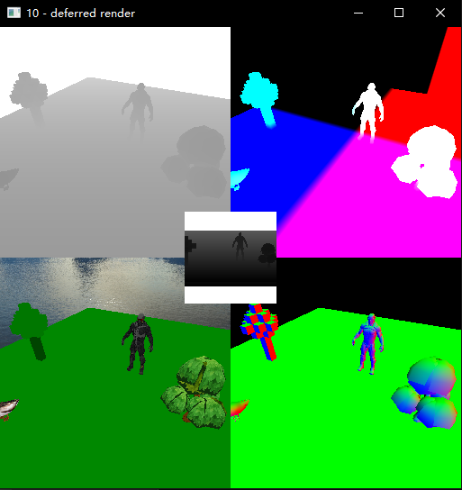
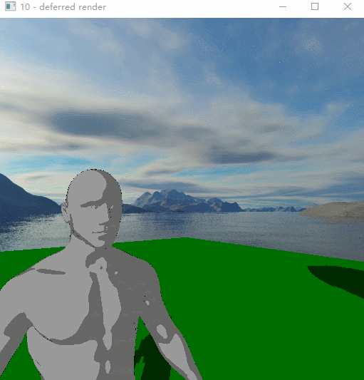
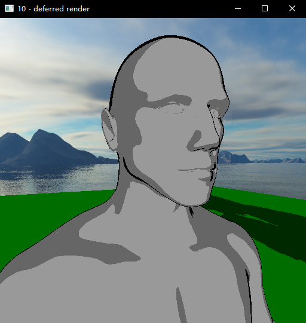

# Deferred-Rendering
## A little experiment to get clear about how this shit works

There are 5 buffers in this fig,respectively

1.depth texture(up&left)

2.wrold position(up&right)

3.color buffer(buttom&left)

4.normal vector(buttom&right)

5.shadow texture(mid)

garbage toon rendering implemented by blinn phong

